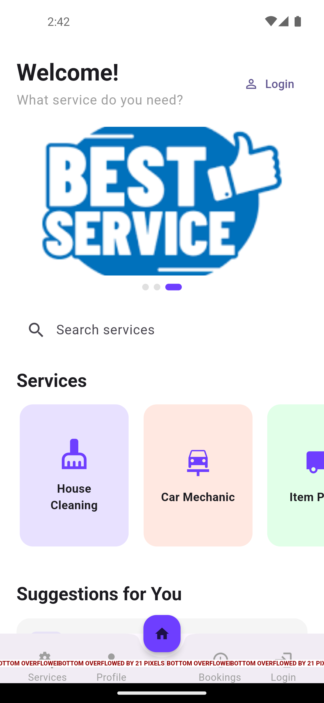

Services App - Flutter Service Booking Application

App Overview
Your app is a comprehensive service booking platform built with Flutter that allows users to browse, search, and book various professional services. It's designed with a modern, user-friendly interface and integrates Firebase for backend services.

 App Screenshots

### Home Screen

## �� App Demo Video

�� Design & Theme

Primary Color: Purple theme (#6E3EFF) with a modern Material Design 3 aesthetic
UI Elements: Rounded corners (12-16px radius), clean cards with subtle shadows
Typography: Clean, readable text with proper hierarchy
Responsive: Well-structured layouts that adapt to different screen sizes

🏗️ Architecture & Structure

State Management: Uses Flutter's built-in StatefulWidget for local state
Navigation: Bottom navigation with 5 main sections + floating action button
Layout System: Custom BaseLayout and MainLayout widgets for consistent UI
Models: Well-structured data models for services and bookings

📱 Core Features

1. Home Screen
   
Welcome Banner: Personalized greeting based on user authentication status
Auto-sliding Banners: 3 promotional banners with automatic rotation
Service Categories: Quick access to different service types
Login Integration: Seamless authentication flow

2. Services Screen
   
Search & Filter: Text search with category and city filters
Service Categories: Home Services, Cleaning, Repairs, Transport, Professional
City Selection: Malaysian cities (KL, Petaling Jaya, Shah Alam, etc.)
Service Cards: Visual representation with icons and pricing

3. Service Details
   
Comprehensive Info: Name, description, features, pricing, available cities
Image Gallery: Multiple images per service
Booking Integration: Direct path to booking process

4. Booking System
   
Date & Time Selection: Calendar and time picker integration
Location Services: City and address selection
Notes & Customization: Additional requirements input
Firebase Integration: Real-time booking storage

5. User Management
    
Authentication: Firebase Auth integration
Profile Management: User account settings
Booking History: Track past and current bookings
Notifications: Local push notifications for booking updates
�� Technical Features

�� Target Services

The app is designed for Malaysian market with services including:

🧹 Cleaning Services (Home, Office, Deep Cleaning)
🔧 Repair & Maintenance (Electrical, Plumbing, HVAC)
🚚 Transport & Delivery (Moving, Package Delivery)
👔 Professional Services (Consulting, Legal, Financial)
�� Key Strengths

Modern UI/UX: Clean, intuitive interface with smooth animations
Comprehensive Booking: End-to-end service booking workflow
Location-Based: City-specific service availability
Real-time Updates: Firebase integration for live data
Cross-platform: Works on all major platforms
Scalable Architecture: Well-structured codebase for future enhancements

